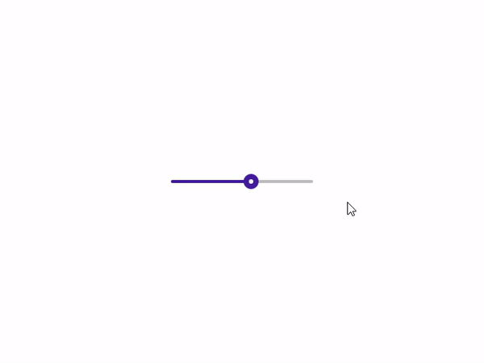

# balloon-slider

QML Slider with balloon style 

The implementation of the Twitter [#UXEChallenge1](https://twitter.com/hashtag/UXEChallenge1?src=hashtag_click) 



## Usage

add the `BaloonSlider.qml` file to your project and use BaloonSlider like other QML elements.

(e.g):

```
//main.qml 
import QtQuick 2.12
import QtQuick.Controls 2.12

ApplicationWindow {
    visible: true
    width: 640
    height: 480
    title: qsTr("Hello World")

    BaloonSlider {
        anchors.centerIn: parent
    }
}
```

